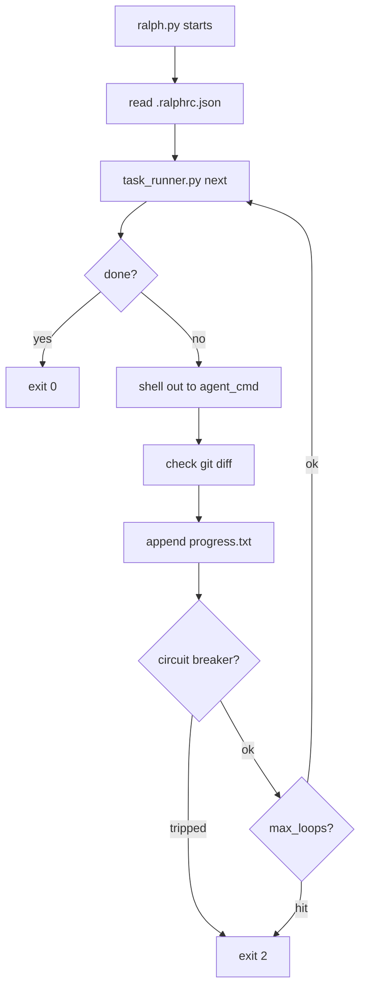

# ralph-scaffold

A tool-agnostic scaffold for the [Ralph loop](https://github.com/anthropics/ralph) — the
autonomous AI coding agent methodology. Drop it into any project and hand it to Claude Code,
OpenHands, Amp, or any agent CLI.

## What is this?

The Ralph loop is a structured approach to autonomous coding: the agent reads a task list,
implements one task at a time, runs tests, commits, and repeats. `ralph-scaffold` gives you:

- `task_runner.py` — reads/writes `prd.json` state: next task, mark complete, mark blocked
- `ralph.py` — loop runner: calls your agent CLI, checks progress, enforces circuit breakers
- `pre-commit` hook — blocks commits when tests fail
- `PROMPT.md` / `AGENTS.md` — agent-readable context templates
- `just onboard <path>` — one command to scaffold a project and get a setup checklist

## Prerequisites

- `mise` — manages Python, uv, and just (install once: `curl https://mise.run | sh`)
- `just` — installed automatically via `mise install`
- Python 3.12+ — installed automatically via `mise install`
- `uv` — installed automatically via `mise install`
- A git repo to install into
- An agent CLI (Claude Code, OpenHands, Amp, etc.)

## Quickstart

**Step 1 — Clone and install tools:**

```bash
git clone https://github.com/armarquez/ralph-scaffold
cd ralph-scaffold
mise install        # installs Python 3.12, uv, and just
just install        # syncs dev deps and wires the pre-commit hook
```

**Step 2 — Onboard your project:**

```bash
just onboard /path/to/your-project
```

This copies the scaffold files and prints a checklist of what to fill in next.
Run `just setup /path/to/your-project` any time to reprint the checklist.

**Step 3 — Fill in the templates and run:**

Follow the checklist from Step 2, then:

```bash
cd /path/to/your-project
just status     # verify task list loaded correctly
just ralph      # dry-run to preview what the loop would call
just loop       # start the loop (calls your agent until all tasks pass)
```

## File Reference

| Path | Purpose |
|------|---------|
| `install.sh` | Entry point: copies scaffold into target project |
| `scaffold/scripts/ralph.py` | Loop runner — calls agent, checks exit gate, circuit breaker |
| `scaffold/scripts/task_runner.py` | prd.json state machine |
| `scaffold/hooks/pre-commit` | Git hook: runs `just check` or `.ralphrc.json` test_cmd |
| `scaffold/.ralph/PROMPT.md` | Agent instructions template |
| `scaffold/.ralph/AGENTS.md` | Build/test/lint commands template |
| `scaffold/prd.json.example` | Annotated prd.json template |
| `scaffold/justfile.example` | justfile template with EDIT THIS markers |
| `scaffold/.mise.toml.example` | .mise.toml template with tool pins |
| `prd.json` | This repo's own task list (self-hosting example) |
| `.ralph/` | This repo's own filled-in agent context |

## How the Loop Works



- **Circuit breaker** opens after N loops with no file changes (`no_progress_threshold`)
  or N loops with the same error output (`same_error_threshold`).
- **Exit gate** is checked each loop via `task_runner.py next`. When all non-optional
  tasks have `passes: true`, it returns `{"done": true}` and the loop exits cleanly.

## Contributing

1. Fork the repo
2. Run `mise install` to get Python, uv, and just
3. Run `just install` to install dev deps and wire the pre-commit hook
4. Work through `TASKS.md` top-to-bottom
5. Run `just check` before every commit
6. Open a PR against `main`
