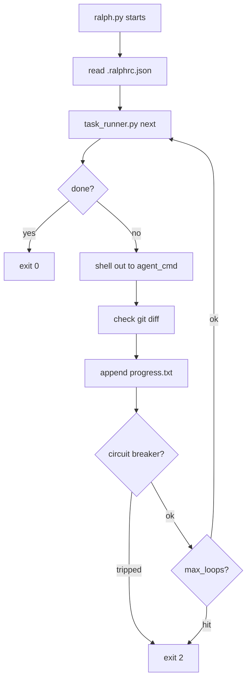

# ralph-scaffold

A tool-agnostic scaffold for the [Ralph loop](https://github.com/anthropics/ralph) — the
autonomous AI coding agent methodology. Drop it into any project and hand it to Claude Code,
OpenHands, Amp, or any agent CLI.

## What is this?

The Ralph loop is a structured approach to autonomous coding: the agent reads a task list,
implements one task at a time, runs tests, commits, and repeats. `ralph-scaffold` gives you:

- `task_runner.py` — reads/writes `prd.json` state: next task, mark complete, mark blocked
- `ralph.py` — loop runner: calls your agent CLI, checks progress, enforces circuit breakers
- `pre-commit` hook — blocks commits when tests fail
- `PROMPT.md` / `AGENTS.md` — agent-readable context templates
- `install.sh` — one command to copy everything into a new project

## Prerequisites

- Python 3.11+
- `uv` (install: `curl -LsSf https://astral.sh/uv/install.sh | sh`)
- A git repo to install into
- An agent CLI (Claude Code, OpenHands, Amp, etc.)

## Quickstart

**Step 1 — Clone and install the scaffold into your project:**

```bash
git clone https://github.com/armarquez/ralph-scaffold
cd ralph-scaffold
./install.sh /path/to/your-project
```

**Step 2 — Fill in the templates:**

```bash
cd /path/to/your-project

# 1. Create your task list
cp scaffold/prd.json.example prd.json
# Edit prd.json: add your project name and stories

# 2. Fill in build/test/lint commands
edit .ralph/AGENTS.md

# 3. Fill in project context for the agent
edit .ralph/PROMPT.md

# 4. Configure the loop runner
edit .ralphrc.json
# Set agent_cmd to your agent (e.g. "claude --dangerously-skip-permissions")
```

**Step 3 — Run the loop:**

```bash
# See current task state
RALPH_PRD=prd.json python scaffold/scripts/task_runner.py status

# Start the loop (calls your agent in a loop until all tasks pass)
python scaffold/scripts/ralph.py

# Dry-run to preview what would be called
python scaffold/scripts/ralph.py --dry-run
```

## File Reference

| Path | Purpose |
|------|---------|
| `install.sh` | Entry point: copies scaffold into target project |
| `scaffold/scripts/ralph.py` | Loop runner — calls agent, checks exit gate, circuit breaker |
| `scaffold/scripts/task_runner.py` | prd.json state machine |
| `scaffold/hooks/pre-commit` | Git hook: blocks commits when tests fail |
| `scaffold/.ralph/PROMPT.md` | Agent instructions template |
| `scaffold/.ralph/AGENTS.md` | Build/test/lint commands template |
| `scaffold/prd.json.example` | Annotated prd.json template |
| `scaffold/.ralphrc.json` | Loop config (agent cmd, max loops, circuit breaker) |
| `prd.json` | This repo's own task list (self-hosting example) |
| `.ralph/` | This repo's own filled-in agent context |

## How the Loop Works



- **Circuit breaker** opens after N loops with no file changes (`no_progress_threshold`)
  or N loops with the same error output (`same_error_threshold`).
- **Exit gate** is checked each loop via `task_runner.py next`. When all non-optional
  tasks have `passes: true`, it returns `{"done": true}` and the loop exits cleanly.

## Contributing

1. Fork the repo
2. Run `uv sync --extra dev` to install dev deps
3. Work through `TASKS.md` top-to-bottom
4. Run `uv run pytest --tb=short -q && uv run ruff check .` before every commit
5. Open a PR against `main`
